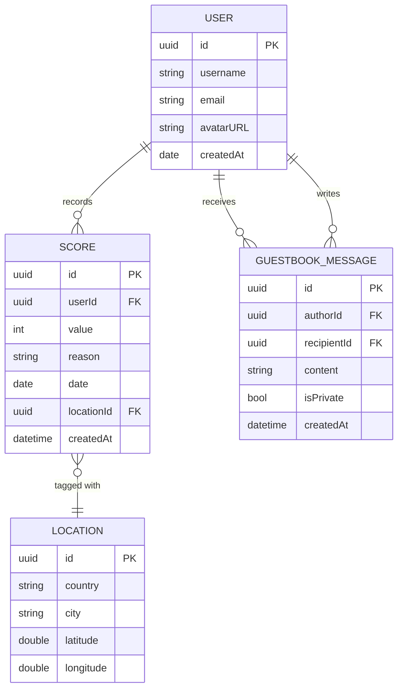

# Scoor! — Product Plan

> **Version:** 1.0  
> **Date:** 2026-03-07  
> **Status:** Pre-Development Planning  

---

## 1. Product Overview

**Scoor!** is a lightweight daily reflection app that replaces traditional long-form journaling with a simple numeric score (0–100).

### Problem
Modern users struggle to maintain journaling habits because writing requires too much time and cognitive effort.

### Solution
Scoor lets users capture how their day went with a single number, optionally accompanied by a short reason. This low-friction method turns daily reflection into a sustainable habit.

### Value Proposition
| Pillar | Description |
|---|---|
| **Simplicity** | One score, one optional note — that's it |
| **Awareness** | Statistics reveal emotional trends over time |
| **Community** | A world map lets users see how people everywhere are feeling |
| **Connection** | Guestbook and public feeds create social bonds around shared experiences |

### Design Language
- **Colors:** White (#FFFFFF) + Red (#E53935 primary, #FF8A80 accent)
- **Style:** Minimal · Clean · Modern
- **Typography:** SF Pro (system default), heavy use of whitespace
- **Iconography:** SF Symbols, line-style

---

## 2. Core User Flow

```
┌─────────────┐
│  App Launch  │
└──────┬──────┘
       ▼
┌─────────────┐     First launch?     ┌───────────────┐
│  Splash      │ ──── Yes ──────────▶ │  Onboarding   │
└──────┬──────┘                       └───────┬───────┘
       │ No                                   │
       ▼                                      ▼
┌──────────────────────────────────────────────────┐
│              Tab Bar (4 Tabs)                    │
├────────────┬───────────┬───────────┬─────────────┤
│  Score!    │ Worldwide │ Statistics│  My Page    │
│  (Tab 1)   │  (Tab 2)  │  (Tab 3)  │  (Tab 4)   │
└────────────┴───────────┴───────────┴─────────────┘
```

### Primary Journey — Recording a Score

1. User opens app → lands on **Score!** tab
2. Enters a numeric score (0–100)
3. *(Optional)* Writes a short reason
4. Taps **Submit**
5. Feedback bubble appears (e.g., *"23 points higher than last week!"*)
6. Score is saved with date + user ID

---

## 3. Information Architecture

```
Scoor!
├── Tab 1: Score!
│   ├── Score Input (0–100)
│   ├── Reason Text Field (optional)
│   ├── Submit Button
│   └── Feedback Bubble (contextual message)
│
├── Tab 2: Worldwide Scoor
│   ├── Interactive World Map
│   │   ├── Zoom Level 1 → Country Scores
│   │   └── Zoom Level 2 → City Scores
│   └── Score Detail View (Instagram DM-style)
│       ├── User Scores List
│       ├── Short Text Reflections
│       └── Timestamps
│
├── Tab 3: Statistics
│   ├── Time Period Selector (Daily / Weekly / Monthly)
│   ├── Score Trend Line Chart
│   ├── Score Distribution Chart
│   ├── Average Score Card
│   └── Streak Tracker
│
└── Tab 4: My Page
    ├── Profile Header
    ├── Calendar View (monthly, colored by score)
    └── Guestbook (Cyworld-style)
        ├── Public Messages
        └── Private Messages
```

---

## 4. Tab Navigation Structure

| # | Tab Label | Icon (SF Symbol) | Landing Screen |
|---|---|---|---|
| 1 | **Score!** | `star.circle.fill` | ScoreInputView |
| 2 | **Worldwide** | `globe` | WorldMapView |
| 3 | **Statistics** | `chart.bar.fill` | StatisticsView |
| 4 | **My Page** | `person.crop.circle` | MyPageView |

- Active tab indicator: **Red** filled icon + label
- Inactive tabs: **Gray** outline icon, no label
- Tab bar background: **White** with subtle top border

---

## 5. Screen List

| Screen ID | Screen Name | Parent Tab | Description |
|---|---|---|---|
| S-01 | SplashView | — | App launch branding screen |
| S-02 | OnboardingView | — | First-launch walkthrough (3 pages) |
| S-03 | ScoreInputView | Score! | Main score entry with optional reason |
| S-04 | ScoreFeedbackView | Score! | Overlay/bubble showing contextual feedback |
| S-05 | WorldMapView | Worldwide | Interactive map with score bubbles |
| S-06 | RegionScoreListView | Worldwide | DM-style list of scores for tapped region |
| S-07 | StatisticsView | Statistics | Dashboard with charts and insights |
| S-08 | MyPageView | My Page | Profile, calendar, and guestbook |
| S-09 | CalendarDetailView | My Page | Expanded view of a specific day's score |
| S-10 | GuestbookComposeView | My Page | Write a public or private guestbook message |
| S-11 | SettingsView | My Page | App settings and account management |

---

## 6. Feature Breakdown

### 6.1 Score! (Tab 1)

| Feature | Priority | Details |
|---|---|---|
| Score input | **P0** | Slider or numeric pad, range 0–100 |
| Optional reason | **P0** | Text field, max 200 characters |
| Submit action | **P0** | Saves score + date + optional reason |
| Feedback bubble | **P1** | Compares current score to past data |
| One score per day | **P0** | If already submitted, allow editing today's score |
| Animated transition | **P2** | Smooth animation on submit success |

**Feedback Bubble Logic:**
- Compare to same day last week → *"X points higher/lower than last week!"*
- Compare to monthly average → *"X points above/below your monthly average!"*
- Streak detection → *"3-day upward streak! 🔥"*
- First entry → *"Welcome! Your Scoor journey begins today."*

### 6.2 Worldwide Scoor (Tab 2)

| Feature | Priority | Details |
|---|---|---|
| World map rendering | **P0** | MapKit-based interactive map |
| Country score bubbles | **P0** | Aggregated average score per country |
| City score bubbles | **P0** | Shown at zoom level 2 |
| Bubble tap → detail list | **P0** | Opens Instagram DM-style score list |
| Score list items | **P0** | Avatar, username, score, reason, timestamp |
| Color-coded bubbles | **P1** | Green (high) → Yellow (mid) → Red (low) |
| District level | **Deferred** | Not included in v1 |

### 6.3 Statistics (Tab 3)

| Feature | Priority | Details |
|---|---|---|
| Period selector | **P0** | Daily / Weekly / Monthly toggle |
| Trend line chart | **P0** | Score over time via Swift Charts |
| Average score | **P0** | Displayed as a prominent card |
| Score distribution | **P1** | Histogram of score frequencies |
| Streak tracking | **P1** | Consecutive days of scoring |
| Best / worst day | **P2** | Highlighted in the trend chart |

### 6.4 My Page (Tab 4)

| Feature | Priority | Details |
|---|---|---|
| Profile header | **P0** | Username, avatar, join date |
| Calendar view | **P0** | Monthly grid, cells colored by score intensity |
| Calendar cell tap | **P1** | Opens CalendarDetailView for that day |
| Guestbook | **P0** | List of messages from other users |
| Public messages | **P0** | Visible to anyone visiting the page |
| Private messages | **P0** | Visible only to page owner |
| Compose message | **P0** | Text input + public/private toggle |

---

## 7. Data Model

### 7.1 Entity Relationship



### 7.2 Swift Model Definitions

| Model | Properties |
|---|---|
| `User` | `id: UUID`, `username: String`, `email: String`, `avatarURL: URL?`, `createdAt: Date` |
| `Score` | `id: UUID`, `userId: UUID`, `value: Int` (0–100), `reason: String?`, `date: Date`, `locationId: UUID?`, `createdAt: Date` |
| `Location` | `id: UUID`, `country: String`, `city: String`, `latitude: Double`, `longitude: Double` |
| `GuestbookMessage` | `id: UUID`, `authorId: UUID`, `recipientId: UUID`, `content: String`, `isPrivate: Bool`, `createdAt: Date` |

---

## 8. API Structure (Future Backend)

All endpoints are prefixed with `/api/v1`.

### Authentication
| Method | Endpoint | Description |
|---|---|---|
| POST | `/auth/signup` | Create account |
| POST | `/auth/login` | Sign in |
| POST | `/auth/logout` | Sign out |

### Scores
| Method | Endpoint | Description |
|---|---|---|
| POST | `/scores` | Submit today's score |
| PUT | `/scores/{id}` | Update today's score |
| GET | `/scores/me` | Get my score history |
| GET | `/scores/me/stats` | Get my statistics (daily/weekly/monthly) |
| GET | `/scores/worldwide?zoom={level}&lat={lat}&lng={lng}` | Get aggregated scores for map |
| GET | `/scores/region/{regionId}` | Get individual scores for a region |

### Guestbook
| Method | Endpoint | Description |
|---|---|---|
| GET | `/users/{id}/guestbook` | Get messages for a user's page |
| POST | `/users/{id}/guestbook` | Post a message to someone's page |
| DELETE | `/guestbook/{messageId}` | Delete a message |

### Users
| Method | Endpoint | Description |
|---|---|---|
| GET | `/users/me` | Get my profile |
| PUT | `/users/me` | Update my profile |
| GET | `/users/{id}` | Get another user's public profile |

---

## 9. SwiftUI App Architecture (MVVM)

### Architecture Diagram

```
┌─────────────────────────────────────────────────┐
│                    View Layer                    │
│  (SwiftUI Views — declarative UI)               │
├─────────────────────────────────────────────────┤
│                 ViewModel Layer                  │
│  (ObservableObject — state + business logic)     │
├─────────────────────────────────────────────────┤
│                  Service Layer                   │
│  (Networking, persistence, location)             │
├─────────────────────────────────────────────────┤
│                   Model Layer                    │
│  (Data structures, Codable conformance)          │
└─────────────────────────────────────────────────┘
```

### Key ViewModels

| ViewModel | Responsibilities |
|---|---|
| `ScoreInputViewModel` | Handle score entry, validation (0–100), save, generate feedback message |
| `WorldMapViewModel` | Manage map region, fetch aggregated scores, handle zoom-level transitions |
| `RegionScoreListViewModel` | Load individual scores for a tapped region |
| `StatisticsViewModel` | Fetch and compute stats (trend, distribution, average, streaks) |
| `MyPageViewModel` | Load calendar data, guestbook messages |
| `GuestbookViewModel` | Compose and send messages, toggle public/private |
| `AuthViewModel` | Handle sign up, login, session management |

### Design Principles

- **Single source of truth:** Each ViewModel owns its state via `@Published` properties
- **Dependency injection:** Services injected via `EnvironmentObject` or initializer
- **Async/Await:** All network calls use Swift concurrency
- **Offline-first:** Scores saved locally (SwiftData) and synced when online
- **Testability:** ViewModels depend on protocols, enabling mock injection

---

## 10. Folder Structure

```
Scoor/
├── ScoorApp.swift                    # App entry point
├── ContentView.swift                 # Root TabView
│
├── Models/
│   ├── User.swift
│   ├── Score.swift
│   ├── Location.swift
│   └── GuestbookMessage.swift
│
├── ViewModels/
│   ├── ScoreInputViewModel.swift
│   ├── WorldMapViewModel.swift
│   ├── RegionScoreListViewModel.swift
│   ├── StatisticsViewModel.swift
│   ├── MyPageViewModel.swift
│   ├── GuestbookViewModel.swift
│   └── AuthViewModel.swift
│
├── Views/
│   ├── Score/
│   │   ├── ScoreInputView.swift
│   │   └── ScoreFeedbackBubble.swift
│   │
│   ├── Worldwide/
│   │   ├── WorldMapView.swift
│   │   ├── ScoreBubbleAnnotation.swift
│   │   └── RegionScoreListView.swift
│   │
│   ├── Statistics/
│   │   ├── StatisticsView.swift
│   │   ├── TrendLineChart.swift
│   │   ├── DistributionChart.swift
│   │   ├── AverageScoreCard.swift
│   │   └── StreakCard.swift
│   │
│   ├── MyPage/
│   │   ├── MyPageView.swift
│   │   ├── CalendarGridView.swift
│   │   ├── CalendarDayCell.swift
│   │   ├── CalendarDetailView.swift
│   │   ├── GuestbookListView.swift
│   │   └── GuestbookComposeView.swift
│   │
│   ├── Onboarding/
│   │   ├── SplashView.swift
│   │   └── OnboardingView.swift
│   │
│   └── Settings/
│       └── SettingsView.swift
│
├── Services/
│   ├── ScoreService.swift            # Score CRUD operations
│   ├── WorldwideService.swift        # Map data fetching
│   ├── StatisticsService.swift       # Stats computation
│   ├── GuestbookService.swift        # Guestbook operations
│   ├── AuthService.swift             # Authentication
│   └── LocationService.swift         # Device location
│
├── Utilities/
│   ├── Extensions/
│   │   ├── Color+Theme.swift         # Red/White theme colors
│   │   ├── Date+Formatting.swift
│   │   └── View+Modifiers.swift
│   ├── Constants.swift               # App-wide constants
│   └── FeedbackEngine.swift          # Score comparison logic
│
├── Resources/
│   ├── Assets.xcassets/
│   └── Localizable.strings
│
└── Preview Content/
    └── PreviewData.swift             # Sample data for SwiftUI previews
```

---

## Appendix: Version Scope

| Feature | v1.0 | v1.1+ |
|---|---|---|
| Score input (0–100) | ✅ | |
| Optional reason text | ✅ | |
| Feedback bubble | ✅ | |
| World map (country + city) | ✅ | |
| District-level zoom | ❌ | 🔜 |
| Statistics (daily/weekly/monthly) | ✅ | |
| Calendar view | ✅ | |
| Guestbook (public + private) | ✅ | |
| Push notifications | ❌ | 🔜 |
| Social sharing | ❌ | 🔜 |
| Dark mode | ❌ | 🔜 |
| Widgets (iOS home screen) | ❌ | 🔜 |
