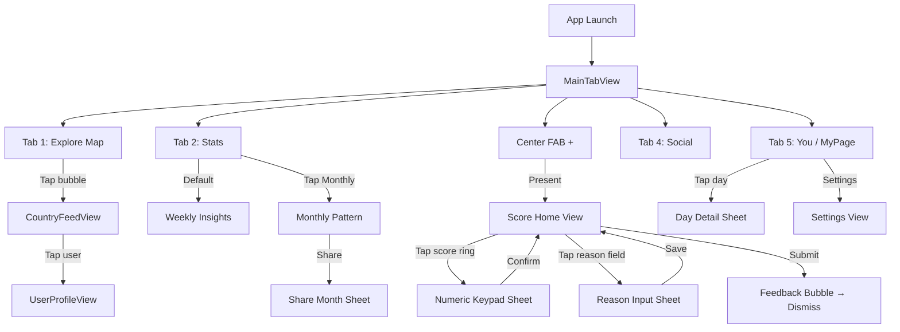

# Scoor! — UI Implementation Plan

> **Based on:** Stitch design files in `/design`  
> **Date:** 2026-03-07  

---

## 1. Design System (Extracted from Stitch)

### Colors

| Token | Hex | Usage |
|---|---|---|
| `primary` | `#F42525` | Buttons, active tabs, scores, accents |
| `primaryLight` | `#FFF1F1` | Soft backgrounds, feed header gradient |
| `backgroundLight` | `#F8F5F5` | App background |
| `white` | `#FFFFFF` | Card backgrounds, bubbles |
| `zinc900` | `#18181B` | Primary text |
| `zinc400` | `#A1A1AA` | Secondary text, inactive icons |
| `zinc100` | `#F4F4F5` | Borders, input backgrounds |

### Typography

| Style | Font | Weight | Size |
|---|---|---|---|
| App Logo | Plus Jakarta Sans | 800 (ExtraBold) | 24pt, italic, tracking-tighter |
| Score Display | Plus Jakarta Sans | 900 (Black) | 120pt |
| Score Bubble | Plus Jakarta Sans | 900 (Black) | 18pt, italic |
| Section Title | Plus Jakarta Sans | 700 (Bold) | 28pt |
| Body | Plus Jakarta Sans | 500 (Medium) | 14pt |
| Caption | Plus Jakarta Sans | 700 (Bold) | 10pt, uppercase, tracking-widest |

### Corner Radii
- Cards/Panels: `16pt` (1rem)
- Large panels: `32pt` (2rem)
- Bottom sheets: `40pt` (2.5rem) top corners
- Buttons: `9999pt` (full pill)

---

## 2. Tab Bar (from designs)

The designs show a **5-item tab bar** with a center floating action button:

```
┌─────┬─────┬─────┬─────┬─────┐
│ 🏠  │ 📊  │ ➕  │ 💬  │ 👤  │
│Home │Stats│     │Social│ You │
└─────┴─────┴─────┴─────┴─────┘
               ↑
         Floating red
         rounded square
         (w-14 h-14)
```

| Position | Icon | Label | SF Symbol |
|---|---|---|---|
| 1 | `home` / `map` | Home / Explore | `house.fill` / `map.fill` |
| 2 | `analytics` | Stats | `chart.bar.fill` |
| 3 | ➕ (FAB) | — | `plus` (center, elevated) |
| 4 | `forum` | Social | `bubble.left.and.bubble.right.fill` |
| 5 | `person` | You | `person.fill` |

> **Note:** The tab bar varies slightly between designs (Home/Explore). The Score Input is NOT a tab — it's triggered by the **center FAB (+)** button. The map (Explore) appears on Tab 1 in `worldwide_scoor_map_2`.

### FAB Button Styling
- 56x56pt red rounded square (`cornerRadius: 16`)
- White `+` icon, 30pt
- Elevated with `ring-8 ring-white`
- `shadow-xl shadow-primary/40`
- Positioned: floats 20pt above tab bar

---

## 3. SwiftUI Screen Mapping

### Design → View Mapping

| Design Folder | SwiftUI View | Tab / Presentation | Screen Purpose |
|---|---|---|---|
| `daily_score_input_1` | `ScoreHomeView` | TAB 1 (Home) | Main home with circular ring, feedback, tags |
| `daily_score_input_2` | `NumericKeypadSheet` | Sheet from Home | Custom numpad for direct score entry |
| `daily_score_input_3` | `ReasonInputSheet` | Sheet from Home | "Why this score?" bottom sheet with Quick Tags |
| `worldwide_scoor_map_2` | `ExploreMapView` | TAB 1 (Explore) | World map with speech bubble annotations |
| `worldwide_scoor_map_1` | `CountryFeedView` | Push from Map | Country-specific feed (Instagram DM-style) |
| `score_statistics_1` | `WeeklyInsightsView` | TAB 2 (Stats) | Bar chart, streak, highest/lowest cards |
| `score_statistics_2` | `MonthlyPatternView` | Push from Stats | Heatmap calendar + pattern summary |
| `instagram_story_share_modal` | `ShareMonthSheet` | Sheet from Stats | Monthly report card + share/save actions |
| `mypage_main` | `MyPageView` | TAB 5 (You) | Calendar + guestbook |

---

## 4. View Hierarchy

```
ScoorApp
└── MainTabView
    ├── Tab 1: ExploreMapView
    │   ├── Header (scoor! logo + GLOBAL/LOCAL toggle)
    │   ├── SearchBar (search input + filter button)
    │   ├── MapContainer
    │   │   ├── WorldMapBackground (image-based or MapKit)
    │   │   ├── ScoreSpeechBubble (per country, tappable)
    │   │   └── ZoomControls (+/- buttons + my location)
    │   ├── WorldAverageBar (bottom floating card)
    │   └── → Push: CountryFeedView
    │       ├── FeedHeader (country name + national average card)
    │       └── ScoreFeedList
    │           └── ScoreFeedCard (avatar, name, reason, score, likes)
    │
    ├── Tab 2: StatsView
    │   ├── Header ("Advanced Insights" + calendar icon)
    │   ├── PeriodSegmentPicker (Daily / Weekly / Monthly)
    │   ├── WeeklyInsightsView (default)
    │   │   ├── PeriodHeader (date range + percentage)
    │   │   ├── BarChartView (M-T-W-T-F-S-S)
    │   │   │   └── ChartTooltip (reason + day + score)
    │   │   ├── StatsRow
    │   │   │   ├── StreakRingCard (circular progress + days)
    │   │   │   └── CompletionRingCard (percentage ring)
    │   │   └── HighLowRow
    │   │       ├── HighestDayCard (score + day)
    │   │       └── LowestDayCard (score + day)
    │   └── MonthlyPatternView (pushed or inline)
    │       ├── HeatmapCalendarGrid (7-col, color intensity)
    │       ├── HeatmapLegend (Low → High dots)
    │       └── PatternSummaryList
    │           ├── BestDayRow (trend icon + text)
    │           └── WorstDayRow (trend icon + text)
    │
    ├── Center FAB: → Sheet: ScoreInputFlow
    │   ├── ScoreHomeView
    │   │   ├── Header (scoor! logo + stats/profile buttons)
    │   │   ├── DateLabel ("How was your day?" + date)
    │   │   ├── CircularScoreRing
    │   │   │   ├── BackgroundRing (gray track, 16pt border)
    │   │   │   ├── ProgressArc (red, ~75% filled)
    │   │   │   ├── CenterLabel ("scoor!" diagonal OR score number)
    │   │   │   └── DraggableThumb (circle on ring edge)
    │   │   ├── FeedbackBubble (speech bubble with arrow)
    │   │   ├── ReasonInputField (rounded pill, "Why this score?")
    │   │   ├── QuickTagChips (Productive, Social, Tired)
    │   │   └── SubmitButton ("Score >" red pill)
    │   ├── → Sheet: NumericKeypadSheet
    │   │   ├── ScoreDisplay (large 120pt number + blinking cursor)
    │   │   ├── Subtitle ("What's the number for today?")
    │   │   ├── NumericKeypad (3×4 grid)
    │   │   │   ├── NumberKeys (1-9, 0)
    │   │   │   ├── ClearKey
    │   │   │   └── ConfirmButton (red circle with ✓)
    │   │   └── CloseButton (X top-right)
    │   └── → Sheet: ReasonInputSheet
    │       ├── SheetHandle
    │       ├── Header ("Why this score?" + close)
    │       ├── TextArea (multiline, rounded, "Tell us more...")
    │       ├── QuickTagsSection
    │       │   ├── SectionLabel ("QUICK TAGS")
    │       │   ├── TagChip (Work, Family, Health, Hobbies)
    │       │   └── AddTagButton (+)
    │       └── SaveButton ("Save Entry ✓" red pill)
    │
    ├── Tab 4: SocialView (placeholder for v2)
    │
    └── Tab 5: MyPageView
        ├── ProfileHeader (avatar + @username + monthly avg)
        ├── CalendarView
        │   ├── MonthNavigation (< October 2023 >)
        │   ├── WeekdayHeaders (S M T W T F S)
        │   └── DayGrid
        │       └── CalendarDayCell
        │           ├── DayNumber
        │           ├── ScoreNumber (colored red, varying weight)
        │           └── TodayHighlight (red circle fill)
        ├── InsightCardsRow
        │   ├── StreakCard (🔥 "12 Day Streak")
        │   └── HighlightCard (🏆 "Best Day: Oct 10th, 92 pts")
        ├── GuestbookSection
        │   ├── SectionHeader ("Guestbook" + entry count)
        │   ├── ComposeBar (text input + red send button)
        │   ├── GuestbookMessage (public)
        │   │   ├── Avatar + Username + Badge ("BESTIE")
        │   │   ├── MessageText
        │   │   ├── Timestamp + Reply + Delete
        │   │   └── VisibilityIcon (eye)
        │   ├── GuestbookMessage (private)
        │   │   ├── LockIcon + "Secret Friend"
        │   │   ├── BlurredText ("This message is only visible to you")
        │   │   └── UnlockButton
        │   └── FAB (+ button, bottom-right)
        └── TabBar
```

---

## 5. Component Breakdown

### 5.1 Reusable Components

| Component | Used In | Description |
|---|---|---|
| `ScoorLogo` | ScoreHome, Map | Red italic "scoor!" text, consistent styling |
| `ScoreSpeechBubble` | Map, Feed | Rounded pill with score + country label, triangle pointer |
| `CircularProgressRing` | ScoreHome, StreakCard, CompletionCard | Circular track + colored arc + center content |
| `QuickTagChip` | ScoreHome, ReasonSheet | Pill button with border (outline or filled) |
| `FeedbackBubble` | ScoreHome | Pink background card with triangle pointer at top |
| `PeriodSegmentPicker` | Stats | 3-segment rounded pill (Daily/Weekly/Monthly) |
| `StatCard` | Stats, MyPage | White rounded card with icon + label + value |
| `BarChartView` | Stats (Weekly) | 7-column bar chart with tooltip on active bar |
| `HeatmapGrid` | Stats (Monthly) | 7×5 grid with intensity-mapped colors |
| `ScoreFeedCard` | CountryFeed | Avatar + username + reason + score + social actions |
| `GuestbookMessageCard` | MyPage | Left-border card with avatar, badge, message, actions |
| `CalendarGrid` | MyPage | Month calendar with score numbers in day cells |
| `RedPillButton` | Global | Full-width red rounded button with icon |
| `BottomSheet` | NumericKeypad, ReasonInput, ShareMonth | Rounded top corners, drag handle, overlay |
| `IconCircleButton` | Map, Header | Circular button with icon (stats, profile, settings) |

### 5.2 New Components (Not in original specs)

| Component | Source Design | Description |
|---|---|---|
| `NumericKeypad` | `daily_score_input_2` | Custom 3×4 grid with CLEAR + confirm button |
| `ChartTooltip` | `score_statistics_1` | Popup showing reason + day name + score on bar tap |
| `CompletionRingCard` | `score_statistics_1` | Month completion % with circular ring |
| `ShareMonthCard` | `instagram_story_share_modal` | Report card preview with heatmap + stats |
| `ShareActionButtons` | `instagram_story_share_modal` | "Share to Instagram Story" + "Save to Gallery" |
| `GuestbookBadge` | `mypage_main` | "BESTIE" pill badge next to username |
| `PrivateMessageCard` | `mypage_main` | Dimmed card with lock icon + "Unlock" action |
| `GlobalLocalToggle` | `worldwide_scoor_map_2` | Segmented pill: GLOBAL / LOCAL |
| `WorldAverageBar` | `worldwide_scoor_map_2` | Floating bottom card with world average + Feed link |

---

## 6. Navigation Flow



---

## 7. Design Deltas vs Original Specs

> [!IMPORTANT]  
> The Stitch designs differ from Plan.md in several key ways. The UI.md designs take **priority**.

| Area | Plan.md Spec | Stitch Design (Use This) |
|---|---|---|
| **Score input** | Slider (0–100) | Circular progress ring with draggable thumb + numeric keypad |
| **Tab count** | 4 tabs | 5 slots (Explore, Stats, FAB, Social, You) |
| **Tab 1** | Score! tab | Explore Map (score input via FAB) |
| **Score range display** | 0–100 integer | Decimal display (e.g., 8.5, 9.2) in feed; 0–100 in input |
| **Reason input** | Inline text field | Separate bottom sheet with Quick Tags |
| **Quick Tags** | Not specified | Work, Family, Health, Hobbies (+ custom) |
| **Map bubbles** | Colored circles | Speech bubbles with score + country label |
| **Stats chart** | Line chart (Swift Charts) | Bar chart with interactive tooltip |
| **Stats extras** | Not specified | Month completion ring, heatmap, share-to-Instagram |
| **Calendar scores** | Color-coded cells | Score numbers in red text (varying intensity) |
| **Guestbook** | Simple messages | Badges (BESTIE), private messages with Unlock, inline compose |
| **Score display font** | 72pt bold | 120pt black weight |

---

## 8. Screen-Level Specifications

### 8.1 Score Home (`daily_score_input_1`)

**Layout:** Vertical centered stack

| Layer | Component | Position | Key Properties |
|---|---|---|---|
| Header | Logo + action buttons | Top | `scoor!` left, stats (pink bg) + profile (gray bg) right |
| Date | "How was your day?" + date | Below header | Gray text, uppercase tracking-widest date |
| Score Ring | `CircularProgressRing` | Center, 288×288pt | 16pt border, gray track, red arc (~75%), thumb on arc |
| Center | "scoor!" text | Inside ring | 48pt, italic, rotated -15°, red |
| Feedback | `FeedbackBubble` | Below ring | Pink bg, triangle pointer up, ✨ emoji prefix |
| Reason | Input field | Below feedback | Gray pill bg, "Why this score?" placeholder, edit icon right |
| Tags | `QuickTagChip` row | Below reason | Horizontal scroll: Productive, Social, Tired |
| Submit | `RedPillButton` | Bottom | "Score >" full width, h-14, shadow |
| Tab Bar | 5-item bar | Fixed bottom | As described in §2 |

### 8.2 Numeric Keypad (`daily_score_input_2`)

**Presentation:** Full-screen sheet or modal

| Layer | Component | Key Properties |
|---|---|---|
| Title | "DAILY SCORE" | Uppercase, tracking-widest, gray |
| Score | Large number | 120pt, black weight, red, blinking cursor |
| Subtitle | "What's the number for today?" | Italic, gray, 14pt |
| Keypad | 3×4 grid | Numbers 1-9, CLEAR (text), 0, ✓ (red circle) |
| Close | X button | Top-right, gray bg circle |

### 8.3 Reason Sheet (`daily_score_input_3`)

**Presentation:** Bottom sheet with backdrop overlay

| Layer | Component | Key Properties |
|---|---|---|
| Handle | Drag indicator | 48×6pt, centered, gray |
| Title | "Why this score?" + close | Bold 24pt + X button |
| TextArea | Multiline input | 6 rows, rounded-2xl, gray bg, 18pt |
| Tags Header | "QUICK TAGS" | Uppercase, tracking-wider, gray, 10pt |
| Tags | Chip buttons | Red border pills: Work, Family, Health, Hobbies, + |
| Save | `RedPillButton` | "Save Entry ✓", shadow-xl |

### 8.4 World Map (`worldwide_scoor_map_2`)

**Layout:** Full-screen map with overlays

| Layer | Component | Key Properties |
|---|---|---|
| Header | Logo + GLOBAL/LOCAL toggle | Red "scoor!" + segmented pill |
| Search | Search bar | White card, search icon, filter button |
| Map | Background map | Grayscale, 40% opacity, zoomed |
| Bubbles | `ScoreSpeechBubble` × N | White border + red text OR solid red (highlighted) |
| Zoom | +/- buttons + my location | Right side, white cards, stacked vertical |
| Average | `WorldAverageBar` | Bottom floating card: icon + "World Average 7.5 +0.2" + Feed link |

### 8.5 Country Feed (`worldwide_scoor_map_1`)

**Layout:** Full-screen list

| Layer | Component | Key Properties |
|---|---|---|
| Nav Bar | ← KOREA FEED ⚙ | Back arrow, uppercase title, filter icon |
| National Avg | Gradient card | Pink gradient bg, "KOREA AVG" + 8.5 in white pill |
| Feed List | `ScoreFeedCard` × N | Avatar (48pt) + name + relative time + reason + score (right) |
| Social | Like + comment buttons | ❤️ filled/outline + count, 💬 chat bubble |
| Tab Bar | 5-item bar | Social tab active (red) |

### 8.6 Weekly Insights (`score_statistics_1`)

**Layout:** Scrollable vertical

| Layer | Component | Key Properties |
|---|---|---|
| Title | "Advanced Insights" + 📅 | Large title + calendar icon button |
| Picker | Period segment | Rounded pill: Daily / Weekly(selected/red) / Monthly |
| Period | "WEEKLY PERFORMANCE" + date range | Uppercase label + date + percentage badge |
| Chart | `BarChartView` | 7 bars (M-S), active bar = solid red, others = pink, y-axis 0-100 |
| Tooltip | `ChartTooltip` | Black bubble with reason + day + score, pointer arrow down |
| Stats Row | 2 cards side by side | StreakRing (5d arc) + CompletionRing (83% arc) |
| High/Low | 2 cards side by side | Highest: 92/100 THURSDAY, Lowest: 30/100 SUNDAY |

### 8.7 Monthly Pattern (`score_statistics_2`)

**Layout:** Scrollable vertical, pushed from Stats

| Layer | Component | Key Properties |
|---|---|---|
| Nav | ← "Monthly Pattern" + 📅 | Back button + title + calendar icon |
| Picker | Period segment | Monthly selected (red) |
| Heatmap | 7-col grid | "OCTOBER 2023 HEATMAP", Low→High legend, 5 weeks of red-intensity cells |
| Caption | "Intensity represents your daily score" | Gray, center-aligned |
| Summary | Pattern cards | Best Day: Wednesday (88 pts avg, green ↗), Worst Day: Monday (54 pts, red ↘) |

### 8.8 Share Month (`instagram_story_share_modal`)

**Presentation:** Bottom sheet (full height)

| Layer | Component | Key Properties |
|---|---|---|
| Title | "SHARE YOUR MONTH" | Red, uppercase, centered |
| Card | Report preview | White rounded card: scoor! logo + "MONTHLY REPORT" + month name + heatmap + stats rows |
| Stats | Average / Top Day / Streak | 78 pts, 92 (MAR 12), 12 Days |
| Share | Red pill button | "Share to Instagram Story" with share icon |
| Save | Outline button | "Save to Gallery" with download icon |
| Dismiss | "Not now" text | Gray, center, tappable |

### 8.9 My Page (`mypage_main`)

**Layout:** Scrollable vertical

| Layer | Component | Key Properties |
|---|---|---|
| Profile | Avatar + username + monthly avg | 48pt avatar, "@sarah_lee", "88.4 MONTHLY AVG" in red |
| Calendar | Month view | ← October 2023 →, S-M-T-W-T-F-S headers |
| Days | Score as numbers | Numbers in red with intensity variation, today = red circle fill |
| Dot | Activity indicator | Small red dot below high-score days |
| Cards | Streak + Highlight | 🔥 "12 Day Streak" + 🏆 "Best Day: Oct 10th, 92 pts" |
| Guestbook | Section header | "Guestbook 📕 128 Entries" |
| Compose | Inline bar | "Leave a nice note..." + red send circle |
| Messages | Card list | Public: avatar + name + BESTIE badge + text + Reply/Delete |
| Private | Dimmed card | Lock icon + "Secret Friend" + blurred text + "Unlock" |
| FAB | + button | Red circle, bottom-right floating |

---

## 9. Animation Notes

| Animation | Screen | Type |
|---|---|---|
| Score ring fill | ScoreHome | Spring animation on value change |
| Cursor blink | NumericKeypad | 1s step-end infinite on cursor bar |
| Bubble scale | Map bubbles | `hover:scale-110`, `active:scale-95` |
| Sheet transition | Bottom sheets | Slide up from bottom with backdrop fade |
| Tooltip appear | Bar chart | Fade in + scale on bar tap |
| Tab FAB ring | Tab bar | White ring-8 around red square |
| Like animation | Feed card | Scale-95 on active + color change |
