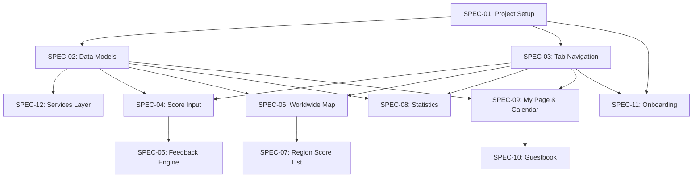

# Scoor! — Spec Index

> All specs are located in `/specs/` and ordered by implementation dependency.

---

## Implementation Order

---

## Spec Summary

| # | Spec | Effort | Priority | Files Created |
|---|---|---|---|---|
| 01 | [Project Setup & Theme](specs/spec-01-project-setup.md) | ~1h | P0 | Color+Theme, Constants, Modifiers, PreviewData |
| 02 | [Data Models](specs/spec-02-data-models.md) | ~45m | P0 | User, Score, Location, GuestbookMessage, aggregates |
| 03 | [Tab Navigation](specs/spec-03-tab-navigation.md) | ~30m | P0 | ContentView (TabView with 4 tabs) |
| 04 | [Score Input](specs/spec-04-score-input.md) | ~2h | P0 | ScoreInputView, ScoreInputViewModel |
| 05 | [Score Feedback](specs/spec-05-score-feedback.md) | ~1.5h | P1 | FeedbackEngine, ScoreFeedbackBubble |
| 06 | [Worldwide Map](specs/spec-06-worldwide-map.md) | ~3h | P0 | WorldMapView, ScoreBubbleAnnotation, WorldMapViewModel |
| 07 | [Region Score List](specs/spec-07-region-score-list.md) | ~1.5h | P0 | RegionScoreListView, RegionScoreListViewModel |
| 08 | [Statistics Dashboard](specs/spec-08-statistics.md) | ~3h | P0 | StatisticsView, Charts, StatisticsViewModel |
| 09 | [My Page & Calendar](specs/spec-09-mypage-calendar.md) | ~2.5h | P0 | MyPageView, CalendarGrid, CalendarDayCell, MyPageViewModel |
| 10 | [Guestbook](specs/spec-10-guestbook.md) | ~2h | P0 | GuestbookListView, GuestbookComposeView, GuestbookViewModel |
| 11 | [Onboarding & Splash](specs/spec-11-onboarding.md) | ~1.5h | P1 | SplashView, OnboardingView, ScoorApp routing |
| 12 | [Services & Networking](specs/spec-12-services.md) | ~3h | P1 | All service protocols + local/mock implementations |

**Total estimated effort: ~22 hours**

---

## Recommended Phases

### Phase 1 — Foundation (Day 1)
`SPEC-01` → `SPEC-02` → `SPEC-03` → `SPEC-12`

### Phase 2 — Core Feature (Day 2)
`SPEC-04` → `SPEC-05`

### Phase 3 — Social & Exploration (Day 3)
`SPEC-06` → `SPEC-07`

### Phase 4 — Insights & Personalization (Day 4)
`SPEC-08` → `SPEC-09` → `SPEC-10`

### Phase 5 — Polish (Day 5)
`SPEC-11`
